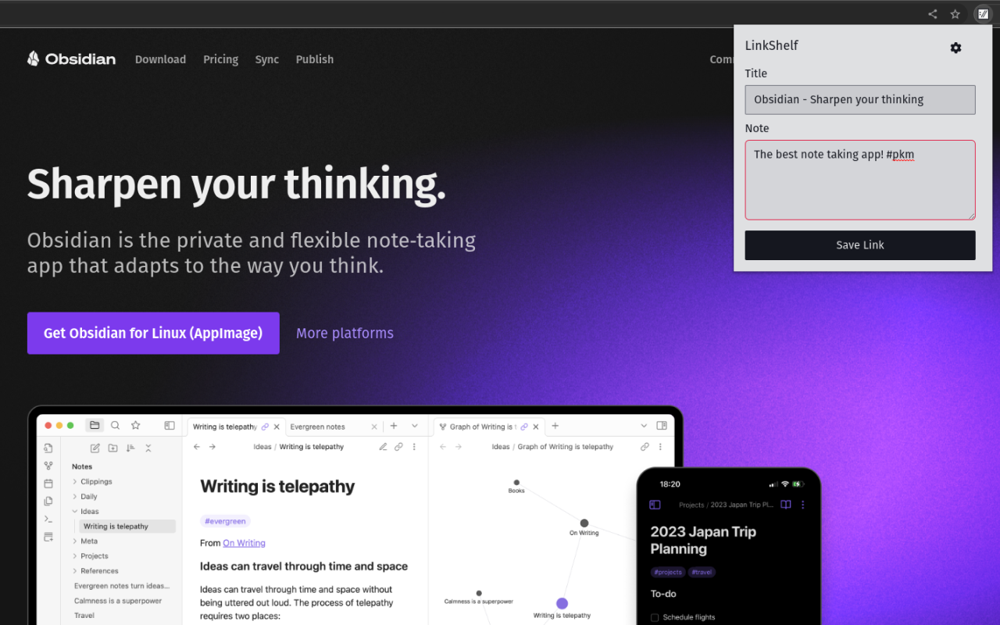

# Obsidian LinkShelf

This repository is the Obsidian plugin for LinkShelf. LinkShelf is a free, open source and privacy-friendly set of tools (Chrome Extension + Obsidian plugin) designed to make it extremely easy to capture and store your valuable online resources in a structured and meaningful way.

Save important bookmarks along with a simple note using the Chrome Extension:



Periodically sync your links with your Obsidian vault.

[linkshelf-obsidian.webm](https://github.com/joelseq/obsidian-linkshelf/assets/12389411/fae8324c-ec3d-4fbc-9b07-23a21333c1c1)

NOTE: This is a very new tool and there may be some bugs and missing functionality.

## Usage

## Prerequisites
1. Create an account at https://linkshelf.app/ and generate an Access Token.
2. Download the [Chrome Extension](https://chrome.google.com/webstore/detail/linkshelf/ahppmgflbaeiphlkkgngijgmfapabgee) and input your Access Token.
3. Start saving links using the Chrome Extension.

## Using the plugin
1. Install this plugin.
2. Go to the Settings > Community Plugins > Installed and ensure "LinkShelf" is enabled.
3. Navigate to the settings for the plugin and configure the plugin:
    3a. Input the Access Token that you previously generated. In case you forgot or lost the one you previously generated, you can create a new one and use that.
    3b. Add the folder path to save links to. IMPORTANT: Make sure this folder exists.
    3c. (Optional) Add the path to a template file to use. See instructions below for creating a template file.
4. Once you have everything configured, run the "Sync" command to sync your saved links using either Command palette (cmd/ctrl+P) or using the ribbon icon "LinkShelf sync" on the sidebar.

Once your links have successfully synced to your Obsidian vault, LinkShelf will no longer store your links. This ensures that your vault is the only long term home for your links!

### Templates

LinkShelf allows you to customize the final output of your link file using a template file provided in the plugin's settings. The following variables are available to be used in your template file:
- title: The title that your link was saved with in the Chrome Extension. This usually defaults to the title of the tab the link was saved from.
- url: The url of the link.
- note: The note that you added for your link using the Chrome Extension.

Here's the default template that files get saved with. Feel free to tweak it to your requirements:
```
---
tags: bookmark
title: "{{title}}"
url: {{url}}
---

# {{title}}

url: {{url}}

{{note}}
```

### Tips

The main use case that I created LinkShelf for is to have a way for me to easily store useful links that integrates well with my existing workflow (which relies heavily on Obsidian) and makes it very easy to query for and organize later. I use it as a bookmarking tool by adding some relevant information in the note like the person that shared that link with me or certain tags like #health, #tech, #learning. I also use it as a read/watch it later tool by adding a #later on the note. With these hashtags and my link template, I can then use this to create [Dataview](https://github.com/blacksmithgu/obsidian-dataview) queries. Example:

Find a list of the links marked as later (this assumes you have a "bookmark" tag added to your links which is in the default template).

```dataview
TABLE url, note
FROM #bookmark and #later
```

### Thanks

The following resources were very helpful resources to look at for learning how to create this plugin:
- [Obsidian Developer Documentation](https://docs.obsidian.md/)
- [Obsidian Kindle Plugin repo](https://github.com/hadynz/obsidian-kindle-plugin)
- [Obsidian Book Search Plugin](https://github.com/anpigon/obsidian-book-search-plugin)

