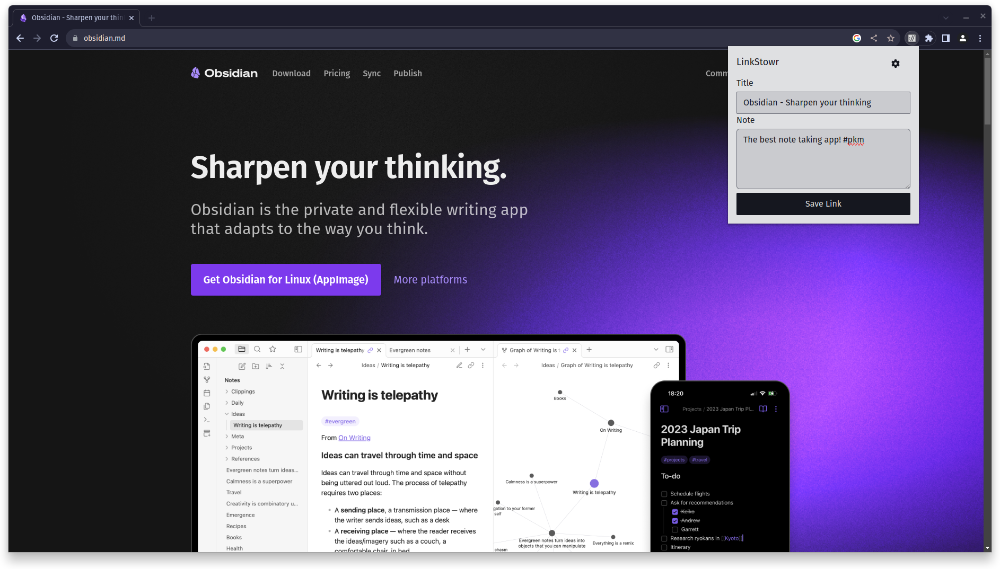
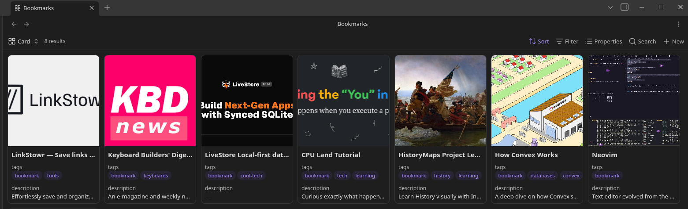

# Obsidian LinkStowr


This repository is the Obsidian plugin for LinkStowr. LinkStowr is a free, open source and privacy-friendly set of tools (Chrome Extension + Obsidian plugin) designed to make it extremely easy to capture and store your valuable online resources in a structured and meaningful way.

Save important bookmarks along with a simple note using the Chrome Extension:



Periodically sync your links with your Obsidian vault.

[linkshelf-obsidian.webm](https://github.com/joelseq/obsidian-linkshelf/assets/12389411/fae8324c-ec3d-4fbc-9b07-23a21333c1c1)

## Usage

## Prerequisites

1. Create an account at https://linkstowr.com/ and generate an Access Token.
2. Download the [Chrome Extension](https://chrome.google.com/webstore/detail/linkstowr/aabkobajeambdejghgegicnhcndhcjpk) and input your Access Token.
3. Start saving links using the Chrome Extension.

## Using the plugin

1. Install this plugin.
2. Go to the Settings > Community Plugins > Installed and ensure "LinkStowr" is enabled.
3. Navigate to the settings for the plugin and configure the plugin:
   - Input the Access Token that you previously generated. In case you forgot or lost the one you previously generated, you can create a new one and use that.
   - Add the folder path to save links to. IMPORTANT: Make sure this folder exists.
   - (Optional) Add the path to a template file to use. See instructions below for creating a template file.
4. Once you have everything configured, run the "Sync" command to sync your saved links using either Command palette (cmd/ctrl+P) or using the ribbon icon "LinkStowr sync" on the sidebar.

Once your links have successfully synced to your Obsidian vault, LinkStowr will no longer store your links. This ensures that your vault is the only long term home for your links!

### Templates

LinkStowr allows you to customize the final output of your link file using a template file provided in the plugin's settings. The following variables are available to be used in your template file:

| Variable          | Description                                                                                                                         |
| ----------------- | ----------------------------------------------------------------------------------------------------------------------------------- |
| `{{title}}`       | The title the link was saved with. Usually defaults to the page title.                                                              |
| `{{url}}`         | The URL of the link.                                                                                                                |
| `{{tags}}`        | Comma-separated tags added while saving the link. When used in a frontmatter `tags:` field, automatically formatted as a YAML list. |
| `{{tagsYaml}}`    | Tags pre-formatted as YAML list items (`  - tag`). Use this for explicit control when placing tags in a custom YAML structure.      |
| `{{note}}`        | The note added for the link using the Chrome Extension.                                                                             |
| `{{description}}` | The description of the page (from meta tags).                                                                                       |
| `{{image_url}}`   | The preview image URL of the page (from Open Graph meta tags).                                                                      |
| `{{bookmarked_at}}` | The date the link was bookmarked. Supports format specifiers e.g. `{{bookmarked_at:YYYY-MM-DD}}`.                                 |

Here's the default template that files get saved with. Feel free to tweak it to your requirements:

```
---
tags: bookmark, {{tags}}
title: "{{title}}"
url: "{{url}}"
description: "{{description}}"
image: "{{image_url}}"
bookmarked_at: "{{bookmarked_at:YYYY-MM-DD}}"
---

{{note}}
```

### Tips

The main use case that I created LinkStowr for is to have a way for me to easily store useful links that integrates well with my existing workflow (which relies heavily on Obsidian) and makes it very easy to query for and organize later. I use it as a bookmarking tool by adding some relevant information in the note like the person that shared that link with me or certain tags like #health, #tech, #learning. I also use it as a read/watch it later tool by adding a #later tag.

#### Obsidian Bases

[Obsidian Bases](https://obsidian.md/bases) is a great way to organize and browse your saved links. You can filter by tags, sort by `bookmarked_at`, and use the **card layout** with the `image` property to get a visual bookmark gallery — similar to Pinterest or a read-it-later app.



#### Dataview

You can also use the [Dataview](https://github.com/blacksmithgu/obsidian-dataview) plugin to query your links. For example, find all links marked as "read later":

```dataview
TABLE url, note
FROM #bookmark and #later
```

### Related repos

- [LinkStowr API v2](https://github.com/joelseq/linkstowr-api-v2)
- [LinkStowr Web App](https://github.com/joelseq/linkstowr-web)
- [LinkStowr Chrome Extension](https://github.com/joelseq/linkstowr-extension)

### Thanks

The following resources were very helpful resources to look at for learning how to create this plugin:

- [Obsidian Developer Documentation](https://docs.obsidian.md/)
- [Obsidian Kindle Plugin repo](https://github.com/hadynz/obsidian-kindle-plugin)
- [Obsidian Book Search Plugin](https://github.com/anpigon/obsidian-book-search-plugin)
